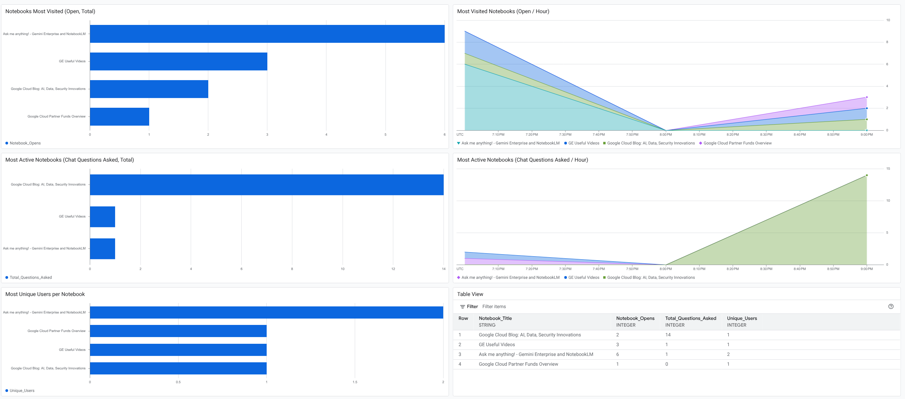

# Guide: Building a NotebookLM Utilization Dashboard

> [!NOTE]  
> This example leverages metrics from the **Standard API Usage / Quota Tracking** to filter and dashboard Discovery Engine and NotebookLM activity logs.


## Summary
In this example we leverage Google Cloud Logging API usage logs to capture real-time activity data. By routing these logs through an analytics-enabled sink, we can track:
- **Engagement:** Total times each notebook was opened.
- **Activity:** Volume of chat questions/sessions per notebook.
- **Reach:** Unique user counts to distinguish between power users and broad adoption.
- **Traffic Trends:** Hourly "heatmaps" of usage via zero-filled time-series charts.

## Architecture Overview
The data pipeline follows this flow:
1. **NotebookLM (Discovery Engine):** The source of activity events.
2. **Observability Layer:** Enabled via `ObservabilityConfig` to capture request/response payloads (like notebook titles).
3. **Cloud Logging:** Captures events under the `discoveryengine.googleapis.com` service.
4. **Log Sink:** A router that filters for specific methods like `GetNotebook` and `GenerateFreeFormStreamed`.
5. **Log Analytics Bucket:** A specialized bucket that stores logs in a BigQuery-compatible format for SQL querying.
6. **Cloud Monitoring Dashboard:** Executes SQL against the bucket to render interactive charts and tables.

## Prerequisites & IAM Roles
To deploy this infrastructure, you need the following permissions:

| Task | Required IAM Role |
|---|---|
| **Enable Observability** | `roles/discoveryengine.admin` |
| **Create Log Buckets/Sinks** | `roles/logging.admin` |
| **Build Dashboard Widgets** | `roles/monitoring.editor` |
| **Run SQL Queries** | `roles/logging.viewAccessor` (on the specific bucket) |


## Implementation Steps

### Step 1: Enable Observability
You must explicitly tell the Discovery Engine to log request/response metadata. Replace the placeholders in the command below:

```bash
curl -X PATCH \
  -H "Authorization: Bearer $(gcloud auth print-access-token)" \
  -H "Content-Type: application/json" \
  "https://[ENDPOINT]-discoveryengine.googleapis.com/v1alpha/projects/[PROJECT_ID]/locations/[LOCATION]/collections/default_collection/engines/[APP_ID]?updateMask=observabilityConfig" \
  -d '{ "observabilityConfig": { "observabilityEnabled": true, "sensitiveLoggingEnabled": true } }'
```

### Step 2: Create the Analytics Bucket
Run this command to create a destination for your usage data:

```bash
gcloud logging buckets create notebooklm-activity-bucket \
    --location=[LOCATION] \
    --enable-analytics \
    --description="Log Analytics bucket for NotebookLM usage metrics"
```

### Step 3: Create the Log Sink
Route the NotebookLM logs into your new bucket:

```bash
gcloud logging sinks create notebooklm-usage-sink \
    logging.googleapis.com/projects/[PROJECT_ID]/locations/[LOCATION]/buckets/notebooklm-activity-bucket \
    --description="Captures GetNotebook and GenerateFreeFormStreamed methods" \
    --log-filter='resource.type="consumed_api" AND resource.labels.service="google.cloud.notebooklm.v1main.NotebookService" AND resource.labels.method=("GetNotebook" OR "GenerateFreeFormStreamed")'
```

### Step 4: Import the Dashboard
1. Navigate to **Cloud Monitoring** > **Dashboards** in the Google Cloud Console.
2. Click **Create Dashboard**.
3. In the top-right of the builder layout, click the **JSON editor** icon (`{ }`).
4. Clear the default layout, paste the contents of the `dashboard/notebooklm_adoption_and_usage.json` file, and click **Apply**.

> [!IMPORTANT]  
> After importing, you must review the imported widgets with SQL queries and swap the placeholder analytics table paths (e.g., `` `genai-whitlstd-rcf.global.notebooklm-activity-bucket._AllLogs` ``) with your actual project names layout.

### Alternative: Deploy via Command Line (gcloud CLI)
If you prefer to create the dashboard programmatically from your terminal, run this from the workspace directory:

```bash
gcloud monitoring dashboards create \
    --config-from-file="dashboard/notebooklm_adoption_and_usage.json"
```

## Example Dashboard
Here is an example of a generated Dashboard created from this pipeline:

